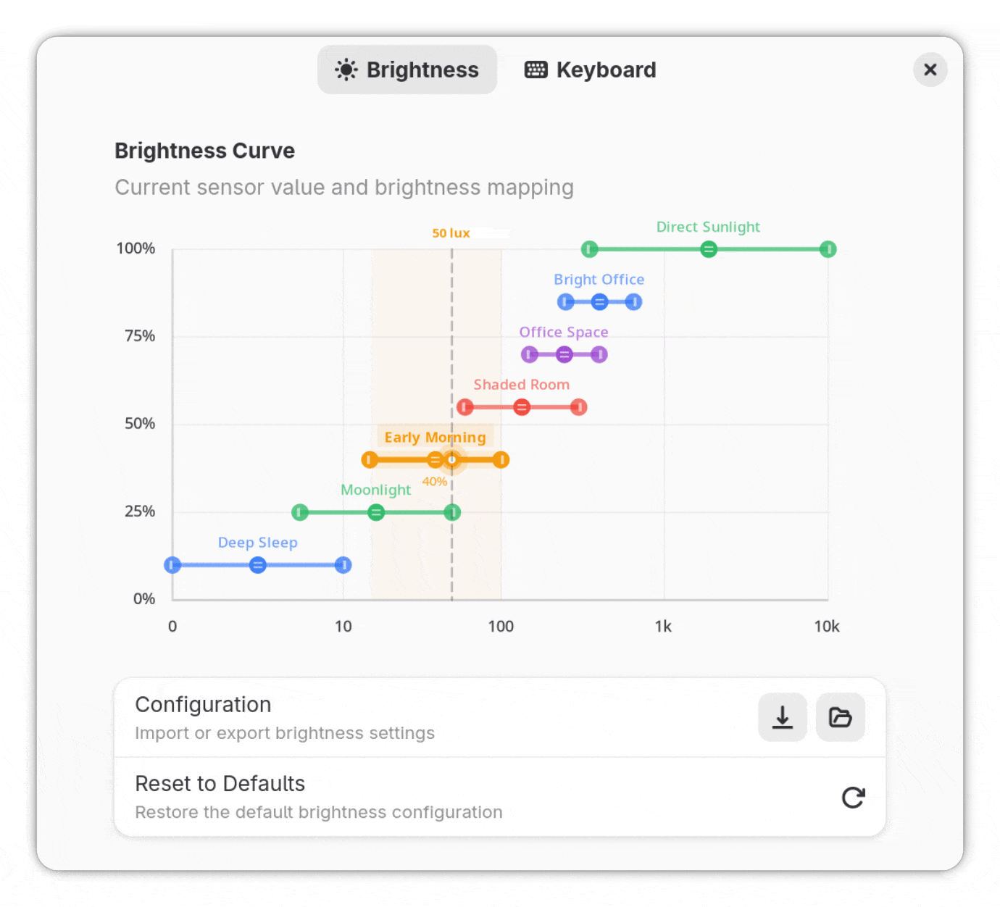
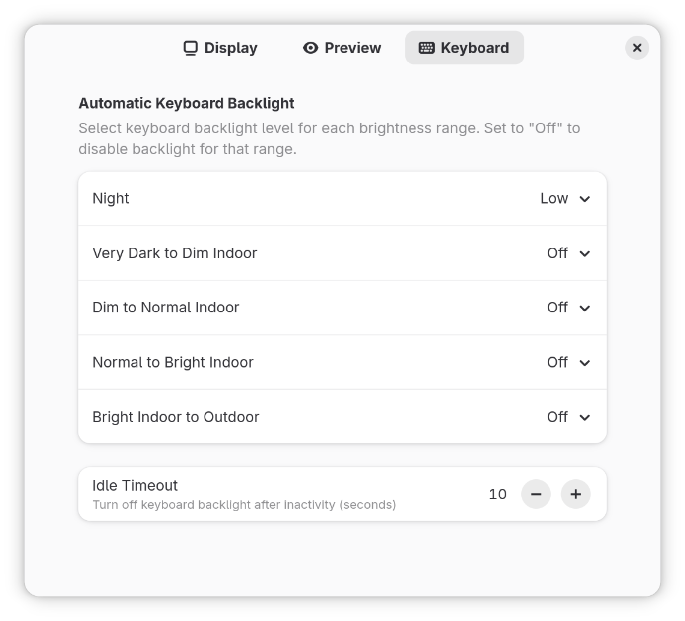

# Adaptive brightness

GNOME Shell extension that automatically adjusts your screen brightness based on ambient light conditions, helping to reduce eye strain and save energy. It also includes an optional keyboard backlight service that runs automatically based on ambient light.

|                                           |                                           |
| :---------------------------------------: | :---------------------------------------: |
|  |  |

# Background

GNOME includes "Automatic Screen Brightness" feature, under Settings -> Power -> Power Saving.
It has a number of issues reported that make it challenging to use in some scenarios:
[#277](https://gitlab.gnome.org/GNOME/gnome-settings-daemon/-/issues/277), [#285](https://gitlab.gnome.org/GNOME/gnome-settings-daemon/-/issues/285), [#575](https://gitlab.gnome.org/GNOME/gnome-settings-daemon/-/issues/575), [#835](https://gitlab.gnome.org/GNOME/gnome-settings-daemon/-/issues/835), [#82](https://gitlab.gnome.org/GNOME/gnome-settings-daemon/-/issues/82), [#237](https://gitlab.gnome.org/GNOME/gnome-settings-daemon/-/merge_requests/237))

This extension addresses some of the above with custom implementation:

- **Improved Algorithm**: More stable under often changing light conditions
- **Smooth Transitions**: Gradually changes brightness to avoid jarring jumps
- **Customizable Brightness Curves**: Configure brightness response with an interactive graph-based UI
- **Configuration Backup/Restore**: Export settings to JSON for backup, sharing, or manual editing to create custom brightness configurations - [example](examples/win11-brightness-config.json).

# Installation

### From Gnome Extensions store

This extension can be found in the [store](https://extensions.gnome.org/extension/8700/adaptive-brightness/).

[](https://extensions.gnome.org/extension/8700/adaptive-brightness/)

### From source

Typically this is needed for testing and development. Clone the repo, pack and install the extension.

```bash
git clone git@github.com:dmy3k/gnome-extension-adaptive-brightness.git
cd gnome-extension-adaptive-brightness
make install
make enable
```

# Supported devices

ALS (ambient light sensor) is required for extension to operate. Some examples of laptops supporting it:

**HP:**

- HP Elitebook 845 G9 (and newer)
- HP Elitebook 840/850/860 G8-G11 series
- HP Spectre x360 (2020 and newer)
- HP Envy x360 (most recent models)
- HP ZBook Studio/Fury/Power G8-G11 series
- HP ProBook 440/450/460 G9-G11 series

**Lenovo:**

- Lenovo Yoga 7 Pro
- Lenovo ThinkPad X1 Carbon (Gen 9 and newer)
- Lenovo ThinkPad X1 Yoga (Gen 6 and newer)
- Lenovo ThinkPad T14/T14s/T16 (Gen 2 and newer)
- Lenovo ThinkPad P1 (Gen 4 and newer)
- Lenovo ThinkPad X13 (Gen 2 and newer)
- Lenovo IdeaPad Slim 7 Pro
- Lenovo Legion 5/7 Pro (2021 and newer)

**Dell:**

- Dell XPS 13/15/17 (2020 and newer)
- Dell Latitude 5000/7000/9000 series (2020 and newer)
- Dell Precision 5000/7000 series (2020 and newer)
- Dell Inspiron 14/16 Plus (2021 and newer)

**Framework:**

- Framework Laptop 13
- Framework Laptop 16

**ASUS:**

- ASUS ZenBook 13/14/15 (2020 and newer)
- ASUS VivoBook Pro 14/15/16 OLED
- ASUS ProArt StudioBook

**Acer:**

- Acer Swift 3/5/7 (2020 and newer)
- Acer TravelMate P2/P4/P6 (recent models)

**System76:**

- System76 Lemur Pro (lemp10 and newer)
- System76 Oryx Pro (oryp8 and newer)

**Note:** Keyboard backlight control availability may vary. Most laptops with ambient light sensors support automatic keyboard backlight adjustment, but this depends on proper driver support in the Linux kernel. Check `ls /sys/class/leds/` for keyboard backlight interfaces.

# References

- [Backlight](https://wiki.archlinux.org/title/Backlight)
- [Keyboard backlight](https://wiki.archlinux.org/title/Keyboard_backlight)
